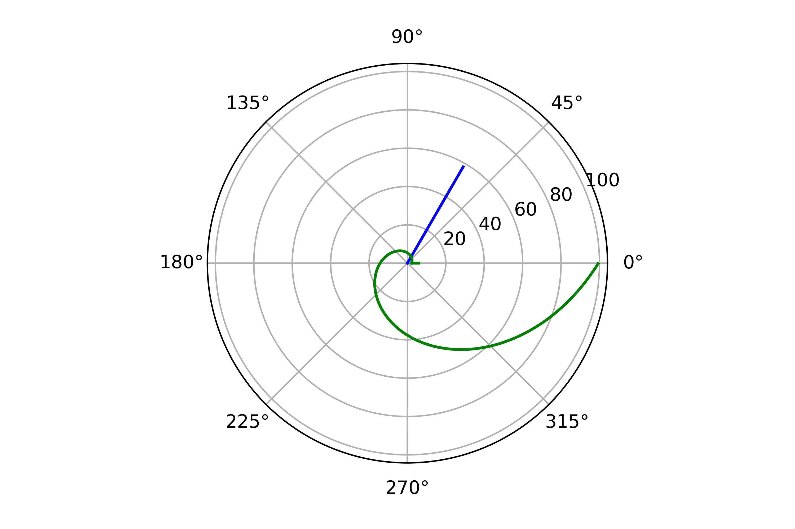
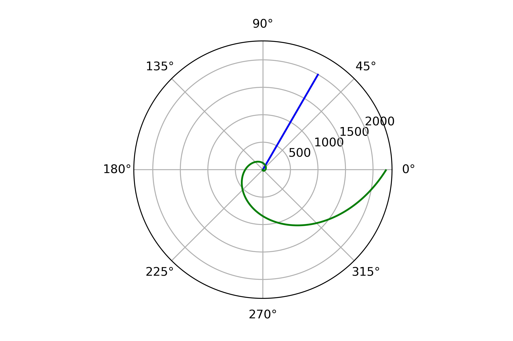

---
# Front matter
lang: ru-RU
title: "Лабораторная работа №2"
subtitle: "Задача о погоне. Вариант 12"
author: "Жижченко Глеб Михайлович"

# Formatting
toc-title: "Содержание"
toc: true # Table of contents
toc_depth: 2
lof: true # List of figures
lot: false # List of tables
fontsize: 12pt
linestretch: 1.5
papersize: a4paper
documentclass: scrreprt
polyglossia-lang: russian
polyglossia-otherlangs: english
mainfont: PT Serif
romanfont: PT Serif
sansfont: PT Serif
monofont: PT Serif
mainfontoptions: Ligatures=TeX
romanfontoptions: Ligatures=TeX
sansfontoptions: Ligatures=TeX,Scale=MatchLowercase
monofontoptions: Scale=MatchLowercase
indent: true
pdf-engine: lualatex
header-includes:
  - \linepenalty=10 # the penalty added to the badness of each line within a paragraph (no associated penalty node) Increasing the value makes tex try to have fewer lines in the paragraph.
  - \interlinepenalty=0 # value of the penalty (node) added after each line of a paragraph.
  - \hyphenpenalty=50 # the penalty for line breaking at an automatically inserted hyphen
  - \exhyphenpenalty=50 # the penalty for line breaking at an explicit hyphen
  - \binoppenalty=700 # the penalty for breaking a line at a binary operator
  - \relpenalty=500 # the penalty for breaking a line at a relation
  - \clubpenalty=150 # extra penalty for breaking after first line of a paragraph
  - \widowpenalty=150 # extra penalty for breaking before last line of a paragraph
  - \displaywidowpenalty=50 # extra penalty for breaking before last line before a display math
  - \brokenpenalty=100 # extra penalty for page breaking after a hyphenated line
  - \predisplaypenalty=10000 # penalty for breaking before a display
  - \postdisplaypenalty=0 # penalty for breaking after a display
  - \floatingpenalty = 20000 # penalty for splitting an insertion (can only be split footnote in standard LaTeX)
  - \raggedbottom # or \flushbottom
  - \usepackage{float} # keep figures where there are in the text
  - \floatplacement{figure}{H} # keep figures where there are in the text
---

# Цель работы

Рассмотреть задачу преследования браконьеров береговой охраной, как пример одной из задач построения математических моделей.

На море в тумане катер береговой охраны преследует лодку браконьеров. Через некоторое время туман рассеивается, и лодка обнаруживается на расстоянии 5.9 км от катера. Затем лодка снова скрывается в тумане и уходит прямолинейно в неизвестном направлении. Известно, что скорость катера в 1.9 раза больше скорости браконьерской лодки.

# Задание

1. Записать уравнение, описывающее движение катера, с начальными
условиями для двух случаев (в зависимости от расположения катера
относительно лодки в начальный момент времени).
2. Построить траекторию движения катера и лодки для двух случаев.
3. Найти точку пересечения траектории катера и лодки.


# Выполнение лабораторной работы

Принимаем за $t_0=0, X_0=0$ - место нахождения лодки браконьеров в момент обнаружения, $X_0=k$ - место нахождения катера береговой охраны относительно лодки браконьеров в момент обнаружения лодки.

Введем полярные координаты. Считаем, что полюс - это точка обнаружения лодки браконьеров $x_0=0 (\theta=x_0=0)$, а полярная ось r проходит через точку нахождения катера береговой охраны.

Чтобы найти расстояние $x$ (расстояние после которого катер начнет двигаться вокруг полюса), необходимо составить простое уравнение. Пусть через время $t$ катер и лодка окажутся на одном расстоянии $x$ от полюса. За это время лодка пройдет $x$, а катер $x-k$ (или $x+k$, в зависимости от начального положения катера относительно полюса). Время, за которое они пройдут это расстояние, вычисляется как $\frac{x}{υ}$ или $\frac{x+k}{υ}$ (для второго случая $\frac{x-k}{υ}$). Так как время одно и то же, то эти величины одинаковы. Тогда неизвестное расстояние можно найти из следующего уравнения: $\frac{x}{υ} = \frac{x+k}{υ}$ - в первом случае, $\frac{x}{υ} = \frac{x-k}{υ}$ во втором случае.

Отсюда мы найдем два значения $x_1$ и $x_2$, задачу будем решать для двух случаев.

$x_1=\frac{k}{n+1}$ ,при $\theta=0$

$x_2=\frac{k}{n-1}$ ,при $\theta=-\pi$

После того, как катер береговой охраны окажется на одном расстоянии от полюса, что и лодка, он должен сменить прямолинейную траекторию и начать двигаться вокруг полюса удаляясь от него со скоростью лодки $υ$. Для этого скорость катера раскладываем на две составляющие: $υ_r$ - радиальная скорость и $υ_t$- тангенциальная скорость. Радиальная скорость - это скорость, с которой катер удаляется от полюса $υ_r=\frac{dr}{dt}$. Нам нужно, чтобы эта скорость была равна скорости лодки, поэтому полагаем $υ=\frac{dr}{dt}$. Тангенциальная скорость – это линейная скорость вращения катера относительно полюса. Она равна произведению угловой скорости $\frac{d\theta}{dt}$ на радиус $r$, $υr=r\frac{d\theta}{dt}$ Найдем тангенциальную скорость для нашей задачи $υ_t=r\frac{d\theta}{dt}$. Вектора образуют прямоугольный треугольник, откуда по теореме Пифагора можно найти тангенциальную скорость $υ_t= \sqrt{n^2 υ_r^2-v^2}$. Поскольку, радиальная скорость равна $υ$, то тангенциальную скорость находим из уравнения $υ_t= \sqrt{n^2 υ^2-υ^2 }$. Следовательно, $υ_τ=υ\sqrt{n^2-1}$.

Тогда получаем $r\frac{d\theta}{dt}=υ\sqrt{n^2-1}$

Решение исходной задачи сводится к решению системы из двух дифференциальных уравнений

$$ \begin{cases} \frac{dr}{dt}=υ \
 r\frac{d\theta}{dt}=υ\sqrt{n^2-1} \end{cases} $$

с начальными условиями

$$ \begin{cases} \theta_0=0 \
 r_0=\frac{k}{n+1} \end{cases}
$$

$$ \begin{cases} \theta_0=-\pi \
 r_0=\frac{k}{n-1} \end{cases}
$$

Исключая из полученной системы производную по t, можно перейти к следующему уравнению: $\frac{dr}{d\theta}=\frac{r}{\sqrt{n^2-1}}$

Начальные условия остаются прежними. Решив это уравнение, мы получим траекторию движения катера в полярных координатах. Теперь, когда нам известно все, что нам нужно, построим траекторию движения катера и лодки для двух случаев.

```python
import numpy as np
import matplotlib.pyplot as plt
from scipy.integrate import odeint

k = 5.9
n = 1.9
fi = np.pi / 3

def f(r, theta):
    return r / np.sqrt(n**2 - 1)

def f2(t):
    return np.tan(theta0) * t

def f3(t):
    return np.tan(fi) * t

r0 = k / (n + 1)
theta0 = 0
theta = np.arange(theta0, np.pi * 2, 0.01)
t1 = np.arange(k, r0, -0.01)
t2 = np.arange(0, 1000, 1)

r = odeint(f, r0, theta)

r_1 = np.sqrt(t1**2 + f2(t1)**2)
t_1 = np.arctan2(f2(t1), t1)

r_2 = np.sqrt(t2**2 + f3(t2)**2)
t_2 = np.arctan2(f3(t2), t2)

plt.polar(t_1, r_1, 'g')
plt.polar(t_2[:30], r_2[:30], 'b')
plt.polar(theta, r, 'g')
plt.savefig("image/fig1", dpi = 500)

r0 = k / (n - 1)
theta0 = -np.pi
theta = np.arange(theta0, np.pi * 2, 0.01)
t1 = np.arange(-k, -r0, 0.01)

r = odeint(f, r0, theta)

r_1 = np.sqrt(t1**2 + f2(t1)**2)
t_1 = np.arctan2(f2(t1), t1)

plt.polar(t_1, r_1, 'g')
plt.polar(t_2, r_2, 'b')
plt.polar(theta, r, 'g')
plt.savefig("image/fig2", dpi = 500)
```

График для первого случая можно видеть на (рис. -@fig:001).

{ #fig:001 width=70% }

Точка пересечения красного и зеленого графиков - точка пересечения катера и лодки, исходя из графика, имеет параметры $$ \begin{cases} \theta=325 \ r=27 \end{cases}
$$

График для второго случая можно видеть на (рис. -@fig:002).

 { #fig:002 width=70% }

 Точка пересечения красного и зеленого графиков - точка пересечения катера и лодки, исходя из графика, имеет параметры $$ \begin{cases} \theta=325 \ r=27 \end{cases}
 $$

# Выводы

Рассмотрели задачу о погоне. Провели анализ и вывод дифференциальных уравнений. Смоделировали ситуацию.
