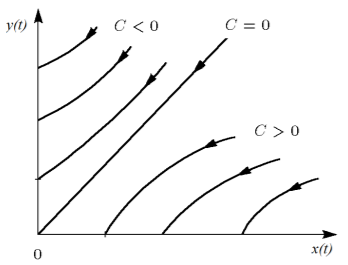

---
## Front matter
lang: ru-RU
title: Лабораторная работа №3
author: |
	Жижченко Глеб Михайлович
institute: |
	RUDN University, Moscow, Russian Federation
date: 2021 Москва

## Formatting
mainfont: PT Serif
romanfont: PT Serif
sansfont: PT Serif
monofont: PT Serif
toc: false
slide_level: 2
theme: metropolis
header-includes: 
 - \metroset{progressbar=frametitle,sectionpage=progressbar,numbering=fraction}
 - '\makeatletter'
 - '\beamer@ignorenonframefalse'
 - '\makeatother'
aspectratio: 43
section-titles: true
---

# Цель работы

Рассмотреть модель боевых действий, как пример одной из задач построения математических моделей.

Между страной $X$ и страной $Y$ идет война. Численность состава войск исчисляется от начала войны, и являются временными функциями $x(t)$ и $y(t)$.
В начальный момент времени страна $X$ имеет армию численностью $50 000$ человек, а
в распоряжении страны $Y$ армия численностью в $39 000$ человек. Для упрощения модели считаем, что коэффициенты
$a, b, c, h$ постоянны. Также считаем
$P(t)$ и $Q(t)$ непрерывные функции.

# Задание

Построить графики изменения численности войск армии $X$ и армии $Y$ для следующих случаев:

1. Модель боевых действий между регулярными войсками

$\frac{dx}{dt}=-0.445x(t)-0.806y(t)+\sin(t+7)+1$

$\frac{dy}{dt}=-0.419x(t)-0.703y(t)+\cos(t+4)+1$

2. Модель ведение боевых действий с участием регулярных войск и партизанских отрядов

$\frac{dx}{dt}=-0.203x(t)-0.705y(t)+\sin(2t)$

$\frac{dy}{dt}=-0.203x(t)y(t)-0.801y(t)+2\cos(t)$

# Выполнение лабораторной рабоы

Рассмотрим модели Ланчестера. В противоборстве могут принимать участие как регулярные войска,
так и партизанские отряды. В общем случае главной характеристикой соперников
являются численности сторон. Если в какой-то момент времени одна из
численностей обращается в нуль, то данная сторона считается проигравшей (при
условии, что численность другой стороны в данный момент положительна).

## Выполнение лабораторной работы

Рассмотри два случая ведения боевых действий:

1. Боевые действия между регулярными войсками
2. Боевые действия с участием регулярных войск и партизанских
отрядов

## Выполнение лабораторной работы

В первом случае численность регулярных войск определяется тремя
факторами:

+ скорость уменьшения численности войск из-за причин, не связанных с
боевыми действиями (болезни, травмы, дезертирство);

+ скорость потерь, обусловленных боевыми действиями
противоборствующих сторон (что связанно с качеством стратегии,
уровнем вооружения, профессионализмом солдат и т.п.);

+ скорость поступления подкрепления (задаётся некоторой функцией от
времени).

## Выполнение лабораторной работы

В этом случае модель боевых действий между регулярными войсками
описывается следующим образом

$\frac{dx}{dt}=-a(t)x(t)-b(t)y(t)+P(t)$

$\frac{dy}{dt}=-c(t)x(t)-h(t)y(t)+Q(t)$

## Выполнение лабораторной работы

Потери, не связанные с боевыми действиями, описывают члены $-a(t)x(t)$ и
$-h(t)y(t)$, члены $-b(t)y(t)$ и $-c(t)x(t)$ отражают потери на поле боя.
Коэффициенты $b(t)$ и $c(t)$ указывают на эффективность боевых действий со
стороны $y$ и $x$ соответственно,
$a(t), h(t)$ - величины, характеризующие степень влияния различных факторов на потери. Функции $P(t), Q(t)$ учитывают
возможность подхода подкрепления к войскам $X$ и $Y$ в течение одного дня.

## Выполнение лабораторной работы

Во втором случае в борьбу добавляются партизанские отряды. Нерегулярные
войска в отличии от постоянной армии менее уязвимы, так как действуют скрытно,
в этом случае сопернику приходится действовать неизбирательно, по площадям,
занимаемым партизанами. Поэтому считается, что темп потерь партизан,
проводящих свои операции в разных местах на некоторой известной территории,
пропорционален не только численности армейских соединений, но и численности
самих партизан.

## Выполнение лабораторной работы

В результате модель принимает вид:

$\frac{dx}{dt}=-a(t)x(t)-b(t)y(t)+P(t)$

$\frac{dy}{dt}=-c(t)x(t)y(t)-h(t)y(t)+Q(t)$

В этой системе все величины имею тот же смысл, что и в первой системе.

## Выполнение лабораторной работы

В простейшей модели борьбы двух противников коэффициенты
$b(t)$ и $c(t)$ являются постоянными. Попросту говоря, предполагается, что каждый солдат
армии $x$ убивает за единицу времени c солдат армии $y$ (и, соответственно, каждый
солдат армии $y$ убивает $b$ солдат армии $x$). Также не учитываются потери, не
связанные с боевыми действиями, и возможность подхода подкрепления.
Состояние системы описывается точкой $(x,y)$ положительного квадранта плоскости.
Координаты этой точки, $x$ и $y$ - это численности противостоящих армий.

## Выполнение лабораторной работы

Тогда модель принимает вид
$$
\begin{cases}
    \dot{x}=-by\\
    \dot{y}=-cx
\end{cases}
$$

## Выполнение лабораторной работы

Это - жесткая модель, которая допускает точное решение

$\frac{dx}{dy}=\frac{by}{cx}$

$cxdx=bydy, cx^2-by^2=C$

## Выполнение лабораторной работы

Эволюция численностей армий $x$ и $y$ происходит вдоль гиперболы, заданной
этим уравнением. По какой именно гиперболе пойдет война, зависит от
начальной точки.

{ #fig:001 width=60% }

## Выполнение лабораторной работы

Эти гиперболы разделены прямой $\sqrt{c}x=\sqrt{b}y$. Если начальная точка лежит
выше этой прямой, то гипербола выходит на ось $y$. Это значит, что в ходе войны
численность армии $x$ уменьшается до нуля (за конечное время). Армия $y$
выигрывает, противник уничтожен.

## Выполнение лабораторной работы

Если начальная точка лежит ниже, то выигрывает армия $x$. В разделяющем
эти случаи состоянии (на прямой) война заканчивается истреблением обеих армий.
Но на это требуется бесконечно большое время: конфликт продолжает тлеть, когда
оба противника уже обессилены.

## Выполнение лабораторной работы

Вывод модели таков: для борьбы с вдвое более многочисленным
противником нужно в четыре раза более мощное оружие, с втрое более
многочисленным - в девять раз и т. д. (на это указывают квадратные корни в
уравнении прямой).

## Выполнение лабораторной работы

Если рассматривать второй случай (война между регулярными войсками и
партизанскими отрядами) с теми же упрощениями, то вторая модель принимает вид:

$\frac{dx}{dt}=-by(t)$

$\frac{dy}{dt}=-cx(t)y(t)$

## Выполнение лабораторной работы

Эта система приводится к уравнению

$\frac{d}{dt}(\frac{b}{2}x^2(t)-cy(t))=0$

которое при заданных начальных условиях имеет единственное решение:

$\frac{b}{2}x^2(t)-cy(t)=\frac{b}{2}x^2(0)-cy(0)=C_1$

## Выполнение лабораторной работы

Из рисунка видно, что при $C_1>0$ побеждает регулярная армия, при $C_1<0$
побеждают партизаны.

{ #fig:002 width=60% }

## Выполнение лабораторной работы

Аналогично противоборству регулярных войск, победа
обеспечивается не только начальной численностью, но и боевой выучкой и
качеством вооружения. При $C_1>0$ получаем соотношение $\frac{b}{2}x^2(0)>cy(0)$.

## Выполнение лабораторной работы

Чтобы одержать победу партизанам необходимо увеличить коэффициент $c$ и повысить
свою начальную численность на соответствующую величину. Причем это
увеличение, с ростом начальной численности регулярных войск $(x(0))$, должно
расти не линейно, а пропорционально второй степени $x(0)$. Таким образом, можно
сделать вывод, что регулярные войска находятся в более выгодном положении, так
как неравенство для них выполняется прим меньшем росте начальной численности войск.

## Выполнение лабораторной работы

Рассмотренные простейшие модели соперничества соответствуют системам
обыкновенных дифференциальных уравнений второго порядка, широко
распространенным при описании многих естественно научных объектов.

# Результаты выполнение работы

{ #fig:003 width=70% }

## Результаты выполнение работы

{ #fig:004 width=70% }

## {.standout}
