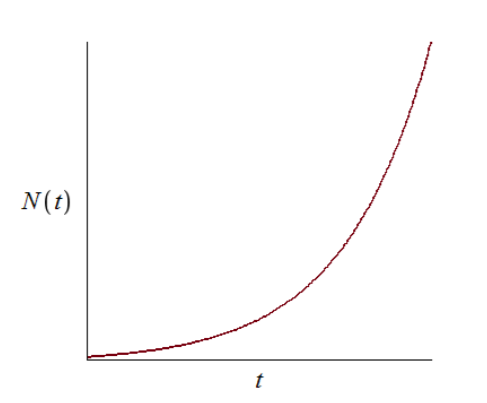
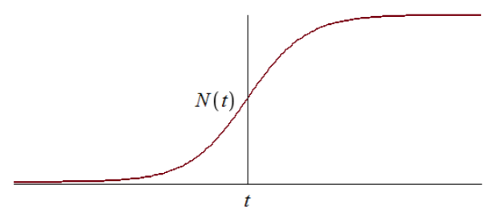
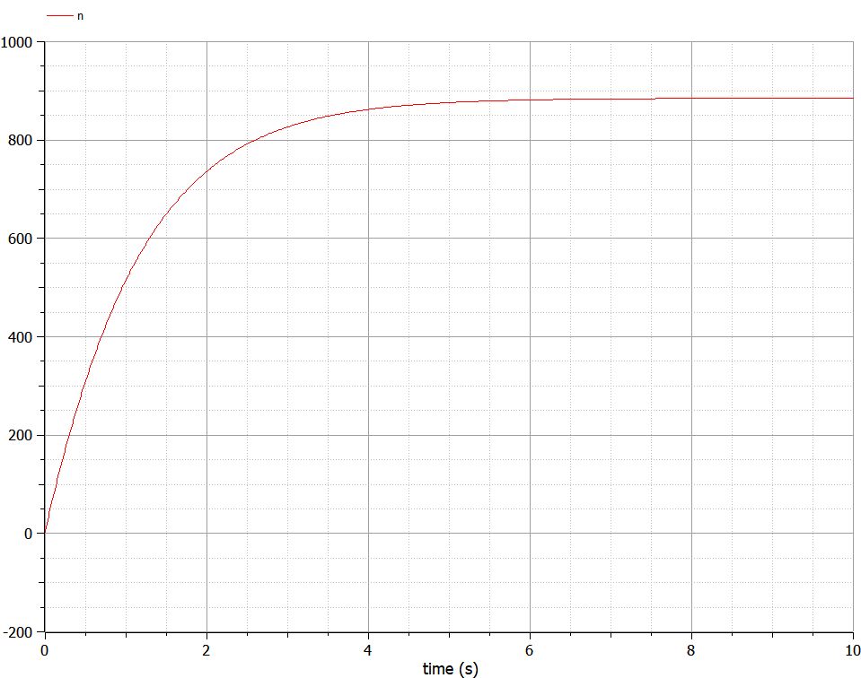
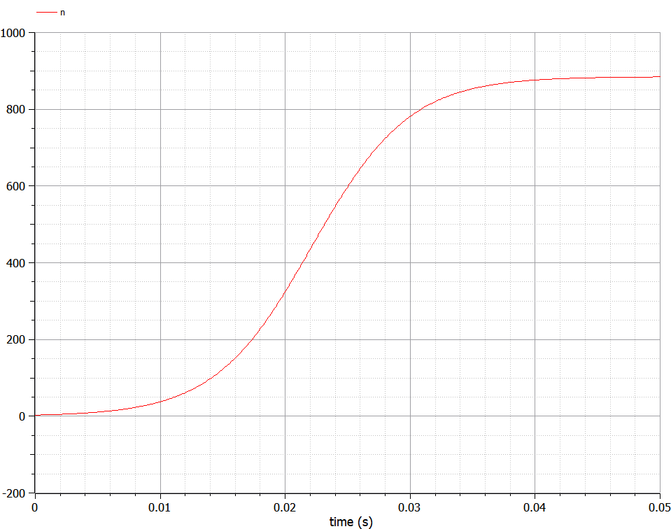
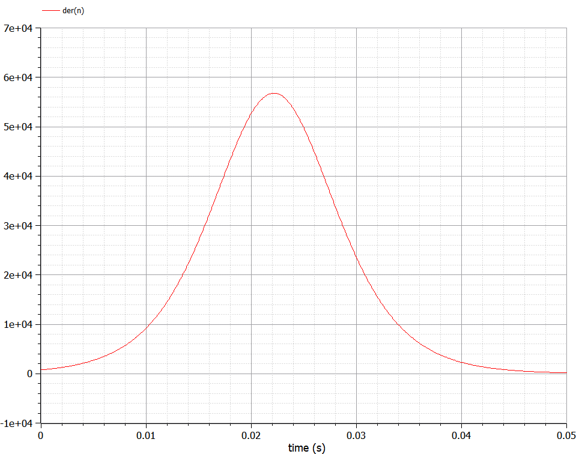
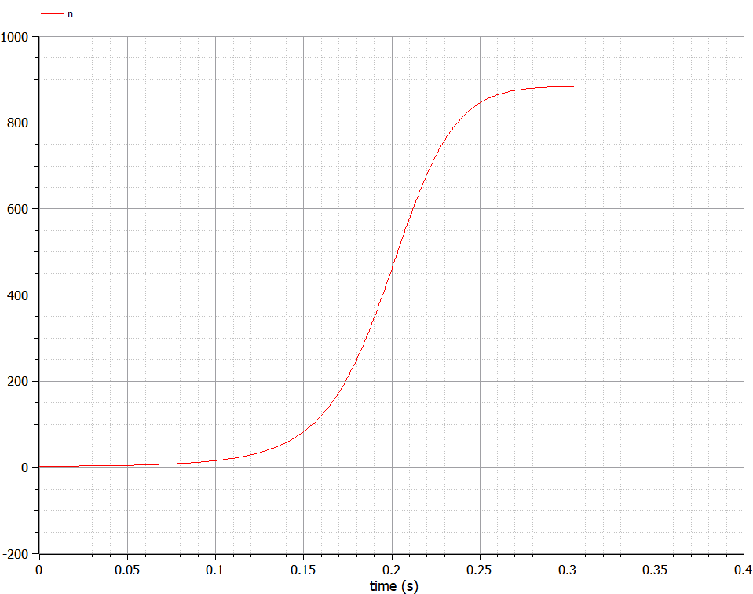

---
## Front matter
lang: ru-RU
title: Лабораторная работа №7
author: |
	Жижченко Глеб Михайлович
institute: |
	RUDN University, Moscow, Russian Federation
date: 2021 Москва

## Formatting
mainfont: PT Serif
romanfont: PT Serif
sansfont: PT Serif
monofont: PT Serif
toc: false
slide_level: 2
theme: metropolis
header-includes: 
 - \metroset{progressbar=frametitle,sectionpage=progressbar,numbering=fraction}
 - '\makeatletter'
 - '\beamer@ignorenonframefalse'
 - '\makeatother'
aspectratio: 43
section-titles: true
---

# Цель работы

Рассмотреть задачу об эффективности рекламы, как пример одной из задач построения математических моделей.

# Задание

Построить график распространения рекламы, математическая модель которой описывается
следующими уравнениями:

1. $\frac{dn}{dt}=(0.83+0.00013n(t))(N-n(t))$
2. $\frac{dn}{dt}=(0.000024+0.29n(t))(N-n(t))$
3. $\frac{dn}{dt}=(0.5t+0.3tn(t))(N-n(t))$

При этом объем аудитории $N=885$, в начальный момент о товаре знает $3$ человека. Для
случая 2 определить в какой момент времени скорость распространения рекламы будет
иметь максимальное значение.

# Выполнение лабораторной работы

Организуется рекламная кампания нового товара или услуги. Необходимо,
чтобы прибыль будущих продаж с избытком покрывала издержки на рекламу.
Вначале расходы могут превышать прибыль, поскольку лишь малая часть
потенциальных покупателей будет информирована о новинке. Затем, при
увеличении числа продаж, возрастает и прибыль, и, наконец, наступит момент,
когда рынок насытиться, и рекламировать товар станет бесполезным.

## Выполнение лабораторной работы

Предположим, что торговыми учреждениями реализуется некоторая
продукция, о которой в момент времени $t$
из числа потенциальных покупателей $N$ знает лишь $n$
покупателей. Для ускорения сбыта продукции запускается реклама
по радио, телевидению и других средств массовой информации. После запуска
рекламной кампании информация о продукции начнет распространяться среди
потенциальных покупателей путем общения друг с другом. Таким образом, после
запуска рекламных объявлений скорость изменения числа знающих о продукции
людей пропорциональна как числу знающих о товаре покупателей, так и числу
покупателей о нем не знающих.

## Выполнение лабораторной работы

Модель рекламной кампании описывается следующими величинами.
Считаем, что $\frac{dn}{dt}$ -- скорость изменения со временем числа потребителей,
узнавших о товаре и готовых его купить, $t$ -- время, прошедшее с начала рекламной
кампании, $n(t)$ -- число уже информированных клиентов. Эта величина
пропорциональна числу покупателей, еще не знающих о нем, это описывается
следующим образом: $\alpha_1(t)(N - n(t))$, где $N$ -- общее число потенциальных
платежеспособных покупателей, $\alpha_1(t)>0$ -- характеризует интенсивность
рекламной кампании (зависит от затрат на рекламу в данный момент времени).

## Выполнение лабораторной работы

Помимо этого, узнавшие о товаре потребители также распространяют полученную
информацию среди потенциальных покупателей, не знающих о нем (в этом случае
работает т.н. сарафанное радио). Этот вклад в рекламу описывается величиной
$\alpha_2(t)n(t)(N-n(t))$, эта величина увеличивается с увеличением потребителей
узнавших о товаре. Математическая модель распространения рекламы описывается
уравнением:

\begin{equation}
\frac{dn}{dt}=(\alpha_1(t)+\alpha_2(t)n(t))(N-n(t))
\end{equation}

## Выполнение лабораторной работы

При $\alpha_1(t) \gg \alpha_2(t)$ получается модель типа модели Мальтуса, решение которой
имеет вид:

{ #fig:001 width=70% }

## Выполнение лабораторной работы

В обратном случае, при $\alpha_1(t) \ll \alpha_2(t)$
получаем уравнение логистической
кривой:

{ #fig:002 width=70% }

# Результаты выполнение работы

{ #fig:003 width=70% }

## Результаты выполнение работы

{ #fig:004 width=70% }

## Результаты выполнение работы

{ #fig:005 width=70% }

## Результаты выполнение работы

{ #fig:006 width=70% }

# Выводы

Рассмотрели задачу об эффективности рекламы. Провели анализ и вывод дифференциальных уравнений.

## {.standout}
