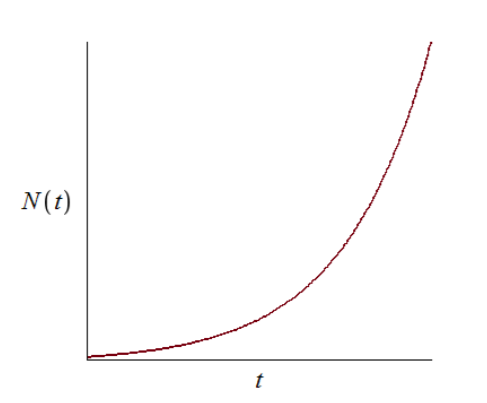
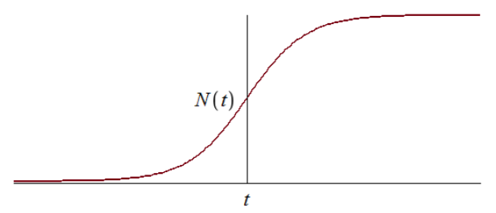
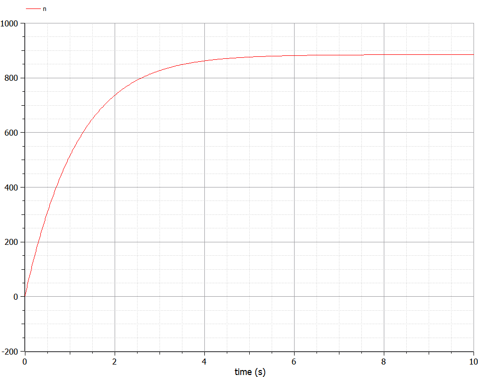
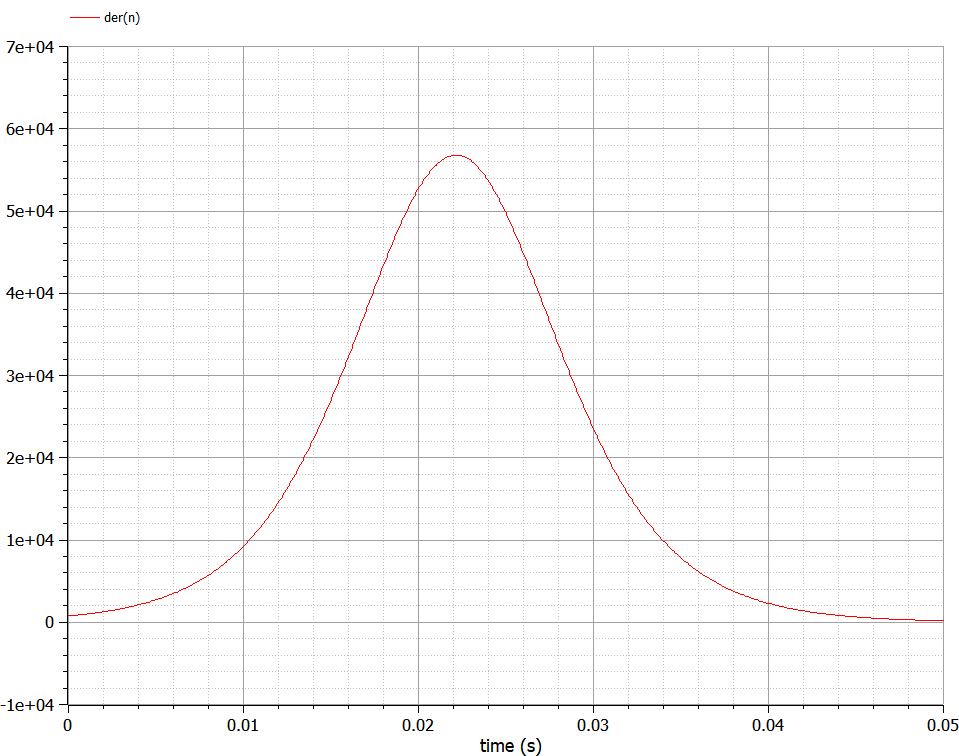

---
# Front matter
lang: ru-RU
title: "Лабораторная работа №7"
subtitle: "Эффективность рекламы. Вариант 12"
author: "Жижченко Глеб Михайлович"

# Formatting
toc-title: "Содержание"
toc: true # Table of contents
toc_depth: 2
lof: true # List of figures
lot: false # List of tables
fontsize: 12pt
linestretch: 1.5
papersize: a4paper
documentclass: scrreprt
polyglossia-lang: russian
polyglossia-otherlangs: english
mainfont: PT Serif
romanfont: PT Serif
sansfont: PT Serif
monofont: PT Serif
mainfontoptions: Ligatures=TeX
romanfontoptions: Ligatures=TeX
sansfontoptions: Ligatures=TeX,Scale=MatchLowercase
monofontoptions: Scale=MatchLowercase
indent: true
pdf-engine: lualatex
header-includes:
  - \linepenalty=10 # the penalty added to the badness of each line within a paragraph (no associated penalty node) Increasing the value makes tex try to have fewer lines in the paragraph.
  - \interlinepenalty=0 # value of the penalty (node) added after each line of a paragraph.
  - \hyphenpenalty=50 # the penalty for line breaking at an automatically inserted hyphen
  - \exhyphenpenalty=50 # the penalty for line breaking at an explicit hyphen
  - \binoppenalty=700 # the penalty for breaking a line at a binary operator
  - \relpenalty=500 # the penalty for breaking a line at a relation
  - \clubpenalty=150 # extra penalty for breaking after first line of a paragraph
  - \widowpenalty=150 # extra penalty for breaking before last line of a paragraph
  - \displaywidowpenalty=50 # extra penalty for breaking before last line before a display math
  - \brokenpenalty=100 # extra penalty for page breaking after a hyphenated line
  - \predisplaypenalty=10000 # penalty for breaking before a display
  - \postdisplaypenalty=0 # penalty for breaking after a display
  - \floatingpenalty = 20000 # penalty for splitting an insertion (can only be split footnote in standard LaTeX)
  - \raggedbottom # or \flushbottom
  - \usepackage{float} # keep figures where there are in the text
  - \floatplacement{figure}{H} # keep figures where there are in the text
---

# Цель работы

Рассмотреть задачу об эффективности рекламы, как пример одной из задач построения математических моделей.

# Задание

Построить график распространения рекламы, математическая модель которой описывается
следующими уравнениями:

1. $\frac{dn}{dt}=(0.83+0.00013n(t))(N-n(t))$
2. $\frac{dn}{dt}=(0.000024+0.29n(t))(N-n(t))$
3. $\frac{dn}{dt}=(0.5t+0.3tn(t))(N-n(t))$

При этом объем аудитории $N=885$, в начальный момент о товаре знает $3$ человека. Для
случая 2 определить в какой момент времени скорость распространения рекламы будет
иметь максимальное значение.

# Выполнение лабораторной работы

Организуется рекламная кампания нового товара или услуги. Необходимо,
чтобы прибыль будущих продаж с избытком покрывала издержки на рекламу.
Вначале расходы могут превышать прибыль, поскольку лишь малая часть
потенциальных покупателей будет информирована о новинке. Затем, при
увеличении числа продаж, возрастает и прибыль, и, наконец, наступит момент,
когда рынок насытиться, и рекламировать товар станет бесполезным.

Предположим, что торговыми учреждениями реализуется некоторая
продукция, о которой в момент времени $t$
из числа потенциальных покупателей $N$ знает лишь $n$
покупателей. Для ускорения сбыта продукции запускается реклама
по радио, телевидению и других средств массовой информации. После запуска
рекламной кампании информация о продукции начнет распространяться среди
потенциальных покупателей путем общения друг с другом. Таким образом, после
запуска рекламных объявлений скорость изменения числа знающих о продукции
людей пропорциональна как числу знающих о товаре покупателей, так и числу
покупателей о нем не знающих.

Модель рекламной кампании описывается следующими величинами.
Считаем, что $\frac{dn}{dt}$ -- скорость изменения со временем числа потребителей,
узнавших о товаре и готовых его купить, $t$ -- время, прошедшее с начала рекламной
кампании, $n(t)$ -- число уже информированных клиентов. Эта величина
пропорциональна числу покупателей, еще не знающих о нем, это описывается
следующим образом: $\alpha_1(t)(N - n(t))$, где $N$ -- общее число потенциальных
платежеспособных покупателей, $\alpha_1(t)>0$ -- характеризует интенсивность
рекламной кампании (зависит от затрат на рекламу в данный момент времени).
Помимо этого, узнавшие о товаре потребители также распространяют полученную
информацию среди потенциальных покупателей, не знающих о нем (в этом случае
работает т.н. сарафанное радио). Этот вклад в рекламу описывается величиной
$\alpha_2(t)n(t)(N-n(t))$, эта величина увеличивается с увеличением потребителей
узнавших о товаре. Математическая модель распространения рекламы описывается
уравнением:

\begin{equation}
\frac{dn}{dt}=(\alpha_1(t)+\alpha_2(t)n(t))(N-n(t))
\end{equation}

При $\alpha_1(t) \gg \alpha_2(t)$ получается модель типа модели Мальтуса, решение которой
имеет вид:

{ #fig:001 width=70% }

В обратном случае, при $\alpha_1(t) \ll \alpha_2(t)$
получаем уравнение логистической
кривой:

{ #fig:002 width=70% }

Код для первого случая на языке Modelica

```
model lab07
parameter Real alpha1 = 0.83;
parameter Real alpha2 = 0.00013;

parameter Integer N = 885;

Real n(start=3);
equation
der(n) = (alpha1 + alpha2 * n) * (N - n);
end lab07;
```

Код для второго случая на языке Modelica

```
model lab07_part2
parameter Real alpha1 = 0.000024;
parameter Real alpha2 = 0.29;

parameter Integer N = 885;

Real n(start=3);
equation
der(n) = (alpha1 + alpha2 * n) * (N - n);
end lab07_part2;
```

Код для третьего случая на языке Modelica

```
model lab07_part3
parameter Real alpha1 = 0.5;
parameter Real alpha2 = 0.3;

parameter Integer N = 885;

Real n(start=3);
equation
der(n) = (alpha1 * time + alpha2 * time * n) * (N - n);
end lab07_part3;
```

График для первого случая можно видеть на рис. -@fig:003.

{ #fig:003 width=70% }

График и скорость распространения рекламы для второго случая можно видеть на рис. -@fig:004 и -@fig:005 соответственно.

{ #fig:004 width=70% }

{ #fig:005 width=70% }

График для третьего случая можно видеть на рис. -@fig:006.

{ #fig:006 width=70% }

# Выводы

Рассмотрели задачу об эффективности рекламы. Провели анализ и вывод дифференциальных уравнений.
