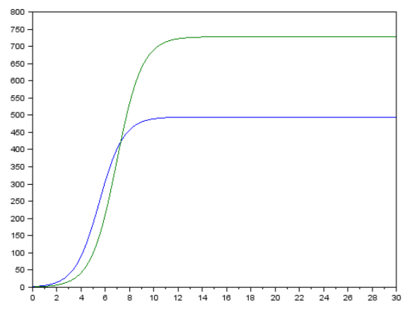
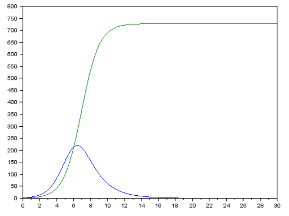
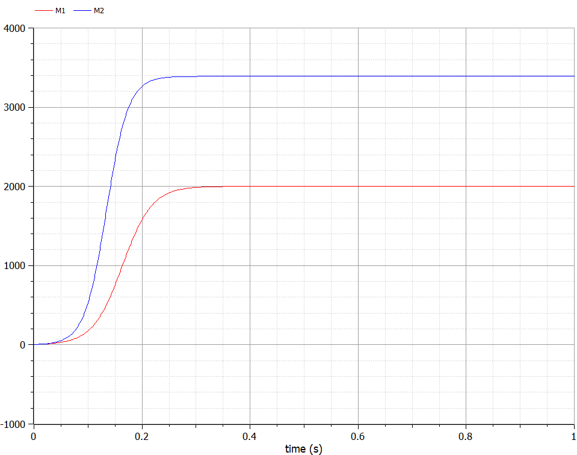
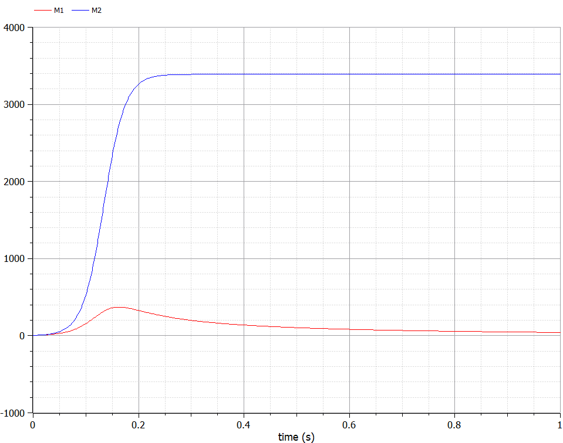

---
## Front matter
lang: ru-RU
title: Лабораторная работа №8
author: |
	Жижченко Глеб Михайлович
institute: |
	RUDN University, Moscow, Russian Federation
date: 2021 Москва

## Formatting
mainfont: PT Serif
romanfont: PT Serif
sansfont: PT Serif
monofont: PT Serif
toc: false
slide_level: 2
theme: metropolis
header-includes: 
 - \metroset{progressbar=frametitle,sectionpage=progressbar,numbering=fraction}
 - '\makeatletter'
 - '\beamer@ignorenonframefalse'
 - '\makeatother'
aspectratio: 43
section-titles: true
---

# Цель работы

Рассмотреть модель конкуренции двух фирм, как пример одной из задач построения математических моделей.

# Задание

**Случай 1.** Рассмотреть две фирмы, производящие взаимозаменяемые товары
одинакового качества и находящиеся в одной рыночной нише. Считать, что в рамках
нашей модели конкурентная борьба ведётся только рыночными методами. То есть,
конкуренты могут влиять на противника путем изменения параметров своего
производства: себестоимость, время цикла, но не могут прямо вмешиваться в
ситуацию на рынке («назначать» цену или влиять на потребителей каким-либо иным
способом.) Будем считать, что постоянные издержки пренебрежимо малы, и в
модели учитываться не будут.

## Задание

В этом случае динамика изменения объемов продаж
фирмы 1 и фирмы 2 описывается следующей системой уравнений:

\begin{equation*}
\begin{split}
&\dfrac{dM_1}{d\theta}=M_1-\dfrac{b}{c_1}M_1M_2-\dfrac{a_1}{c_1}M_1^2\\
&\dfrac{dM_2}{d\theta}=\dfrac{c_2}{c_1}M_2-\dfrac{b}{c_1}M_1M_2-\dfrac{a_2}{c_1}M_2^2
\end{split}
\end{equation*}

## Задание

где:

\begin{equation}
\begin{split}
&a_1=\dfrac{p_{cr}}{\tau_1^2\widetilde{p}_1^2Nq},\\
&a_2=\dfrac{p_{cr}}{\tau_2^2\widetilde{p}_2^2Nq},\\
&b=\dfrac{p_{cr}}{\tau_1^2\widetilde{p}_1^2\tau_2^2\widetilde{p}_2^2Nq},\\
&c_1=\dfrac{p_{cr}-\widetilde{p}_1}{\tau_1\widetilde{p}_1},\\
&c_2=\dfrac{p_{cr}-\widetilde{p}_2}{\tau_2\widetilde{p}_2}
\end{split}
\label{f_16}
\end{equation}

Также введена нормировка $t=c_1\theta$.

## Задание

**Случай 2.** Рассмотреть модель, когда, помимо экономического фактора
влияния (изменение себестоимости, производственного цикла, использование
кредита и т.п.), используются еще и социально-психологические факторы –
формирование общественного предпочтения одного товара другому, не зависимо от
их качества и цены. В этом случае взаимодействие двух фирм будет зависеть друг
от друга, соответственно коэффициент перед $M_1M_2$ будет отличаться. 

## Задание

Пусть в рамках рассматриваемой модели динамика изменения объемов продаж фирмы 1 и
фирмы 2 описывается следующей системой уравнений:

\begin{equation*}
\begin{split}
&\dfrac{dM_1}{d\theta}=M_1-\left(\dfrac{b}{c_1}+0.0003\right)M_1M_2-\dfrac{a_1}{c_1}M_1^2\\
&\dfrac{dM_2}{d\theta}=\dfrac{c_2}{c_1}M_2-\dfrac{b}{c_1}M_1M_2-\dfrac{a_2}{c_1}M_2^2
\end{split}
\end{equation*}

## Задание

Для обоих случаев рассмотреть задачу со следующими начальными условиями и
параметрами:

\begin{equation*}
\begin{split}
&M_0^1=4.9, M_0^2=4.4,\\
&p_{cr}=12, N=39, q=1,\\
&\tau_1=19,\tau_2=29,\\
&\widetilde{p}_1=7.9,\widetilde{p}_2=5.8
\end{split}
\end{equation*}

1. Построить графики изменения оборотных средств фирмы 1 и фирмы 2 без
учета постоянных издержек и с введенной нормировкой для случая 1.
2. Построить графики изменения оборотных средств фирмы 1 и фирмы 2 без
учета постоянных издержек и с введенной нормировкой для случая 2

# Выполнение лабораторной работы

**Модель одной фирмы**

Для построения модели конкуренции хотя бы двух фирм необходимо
рассмотреть модель одной фирмы. Вначале рассмотрим модель фирмы,
производящей продукт долговременного пользования, когда цена его определяется
балансом спроса и предложения. Примем, что этот продукт занимает
определенную нишу рынка и конкуренты в ней отсутствуют.

## Выполнение лабораторной работы

Обозначим:

$N$ -- число потребителей производимого продукта.

$S$ -- доходы потребителей данного продукта. Считаем, что доходы всех
потребителей одинаковы. Это предположение справедливо, если речь идет об
одной рыночной нише, т.е. производимый продукт ориентирован на определенный
слой населения.

$M$ -- оборотные средства предприятия

$\tau$ -- длительность производственного цикла

$p$ -- рыночная цена товара

## Выполнение лабораторной работы

$\widetilde{p}$ -- себестоимость продукта, то есть переменные издержки на производство
единицы продукции.

$\delta$ -- доля оборотных средств, идущая на покрытие переменных издержек.

$\kappa$ -- постоянные издержки, которые не зависят от количества выпускаемой
продукции.

$Q(S/p)$ -- функция спроса, зависящая от отношения дохода $S$ к цене $p$. Она
равна количеству продукта, потребляемого одним потребителем в единицу
времени.

## Выполнение лабораторной работы

Функцию спроса товаров долговременного использования часто
представляют в простейшей форме:

\begin{equation}
Q=q-k\dfrac{p}{S}=q\left(1-\dfrac{p}{p_{cr}}\right)
\label{f_1}
\end{equation}

где $q$ -- максимальная потребность одного человека в продукте в единицу времени.
Эта функция падает с ростом цены и при $p = p_{cr}$ (критическая стоимость продукта)
потребители отказываются от приобретения товара. Величина $p_{cr} = Sq/k$.
Параметр $k$ -- мера эластичности функции спроса по цене. Таким образом, функция
спроса в форме (\ref{f_1}) является пороговой (то есть, $Q(S/p) = 0$ при $p \ge p_{cr}$) и обладает
свойствами насыщения.

## Выполнение лабораторной работы

Уравнения динамики оборотных средств можно записать в виде:

\begin{equation}
\dfrac{dM}{dt}=-\dfrac{M\delta}{\tau}+NQp-\kappa=-\dfrac{M\delta}{\tau}+Nq\left(1-\dfrac{p}{p_{cr}}\right)p-\kappa
\label{f_2}
\end{equation}

## Выполнение лабораторной работы

Уравнение для рыночной цены $p$ представим в виде:

\begin{equation}
\dfrac{dp}{dt}=\gamma\left(-\dfrac{M\delta}{\tau\widetilde{p}}+Nq\left(1-dfrac{p}{p_{cr}}\right)\right)
\label{f_3}
\end{equation}

## Выполнение лабораторной работы

Первый член соответствует количеству поставляемого на рынок товара (то
есть, предложению), а второй член – спросу.

Параметр $\gamma$ зависит от скорости оборота товаров на рынке. Как правило,
время торгового оборота существенно меньше времени производственного цикла $\tau$.
При заданном $M$ уравнение (\ref{f_3}) описывает быстрое стремление цены к
равновесному значению цены, которое устойчиво.

## Выполнение лабораторной работы

В этом случае уравнение (\ref{f_3}) можно заменить алгебраическим соотношением:

\begin{equation}
-\dfrac{M\delta}{\tau\widetilde{p}}+Nq\left(1-\dfrac{p}{p_{cr}}\right)=0
\label{f_4}
\end{equation}

## Выполнение лабораторной работы

Из (\ref{f_4}) следует, что равновесное значение цены $p$ равно:

\begin{equation}
p=p_{cr}\left(1-\dfrac{M\delta}{\tau\widetilde{p}Nq}\right)
\label{f_5}
\end{equation}

## Выполнение лабораторной работы

Уравнение (\ref{f_2}) с учетом (\ref{f_5}) приобретает вид:

\begin{equation}
\dfrac{dM}{dt}=M\dfrac{\delta}{\tau}\left(\dfrac{p}{p_{cr}}-1\right)-M^2\left(\dfrac{\delta}{\tau\widetilde{p}}\right)^2\dfrac{p_{cr}}{Nq}-\kappa
\label{f_6}
\end{equation}

## Выполнение лабораторной работы

Уравнение (\ref{f_6}) имеет два стационарных решения, соответствующих
условию $dM/dt = 0$:

\begin{equation}
\widetilde{M}_{1,2}=\dfrac{1}{2}a\pm \sqrt{\dfrac{a^2}{4}-b}
\label{f_7}
\end{equation}

где:

\begin{equation}
\begin{split}
&a=Nq\left(1-\dfrac{\widetilde{p}}{p_{cr}}\right)\widetilde{p}\dfrac{\tau}{\delta},\\
&b=\kappa Nq\dfrac{\left(\tau\widetilde{p}\right)^2}{p_{cr}\delta^2}
\end{split}
\label{f_8}
\end{equation}

## Выполнение лабораторной работы

Из (\ref{f_7}) следует, что при больших постоянных издержках (в случае $a^2 < 4b$)
стационарных состояний нет. Это означает, что в этих условиях фирма не может
функционировать стабильно, то есть, терпит банкротство. Однако, как правило,
постоянные затраты малы по сравнению с переменными (то есть, $b \ll a^2$) и играют
роль, только в случае, когда оборотные средства малы. При $b \ll a$ стационарные
значения $M$ равны:

\begin{equation}
\begin{split}
&\widetilde{M}_+=Nq\dfrac{\tau}{\delta}\left(1-\dfrac{\widetilde{p}}{p_{cr}}\right)\widetilde{p},\\
&\widetilde{M}_-=\kappa\widetilde{p}\dfrac{\tau}{\delta\left(p_{cr}-\widetilde{p}\right)}
\end{split}
\label{f_9}
\end{equation}

## Выполнение лабораторной работы

Первое состояние $\widetilde{M}_+$ устойчиво и соответствует стабильному
функционированию предприятия. Второе состояние $\widetilde{M}_-$
неустойчиво, так, что при $M < \widetilde{M}_-$
оборотные средства падают ($dM/dt < 0$), то есть, фирма идет к
банкротству. По смыслу $\widetilde{M}_-$
соответствует начальному капиталу, необходимому
для входа в рынок.

## Выполнение лабораторной работы

В обсуждаемой модели параметр $\delta$ всюду входит в сочетании с $\tau$. Это значит,
что уменьшение доли оборотных средств, вкладываемых в производство,
эквивалентно удлинению производственного цикла. Поэтому мы в дальнейшем
положим: $\delta = 1$, а параметр $\tau$ будем считать временем цикла, с учётом сказанного.

## Выполнение лабораторной работы

**Конкуренция двух фирм**

***Случай 1***

Рассмотрим две фирмы, производящие взаимозаменяемые товары
одинакового качества и находящиеся в одной рыночной нише. Последнее означает,
что у потребителей в этой нише нет априорных предпочтений, и они приобретут
тот или иной товар, не обращая внимания на знак фирмы.

## Выполнение лабораторной работы

В этом случае, на рынке устанавливается единая цена, которая определяется
балансом суммарного предложения и спроса. Иными словами, в рамках нашей
модели конкурентная борьба ведётся только рыночными методами. То есть,
конкуренты могут влиять на противника путем изменения параметров своего
производства: себестоимость, время цикла, но не могут прямо вмешиваться в
ситуацию на рынке («назначать» цену или влиять на потребителей какимлибо иным способом.)

## Выполнение лабораторной работы

Уравнения динамики оборотных средств запишем по аналогии с (\ref{f_2}) в виде:

\begin{equation}
\begin{split}
&\dfrac{dM_1}{dt}=-\dfrac{M_1}{\tau_1}+N_1q\left(1-\dfrac{p}{p_{cr}}\right)p-\kappa_1\\
&\dfrac{dM_2}{dt}=-\dfrac{M_2}{\tau_2}+N_2q\left(1-\dfrac{p}{p_{cr}}\right)p-\kappa_2
\end{split}
\label{f_10}
\end{equation}

где использованы те же обозначения, а индексы 1 и 2 относятся к первой и второй
фирме, соответственно. Величины $N_1$ и $N_2$ -- числа потребителей, приобретших
товар первой и второй фирмы.

## Выполнение лабораторной работы

Учтем, что товарный баланс устанавливается быстро, то есть,
произведенный каждой фирмой товар не накапливается, а реализуется по цене $p$.
Тогда:

\begin{equation}
\begin{split}
&\dfrac{M_1}{\tau\widetilde{p}_1}=N_1q\left(1-\dfrac{p}{p_{cr}}\right)\\
&\dfrac{M_2}{\tau\widetilde{p}_2}=N_2q\left(1-\dfrac{p}{p_{cr}}\right)
\end{split}
\label{f_11}
\end{equation}

где $\widetilde{p}_1$ и $\widetilde{p}_2$ себестоимости товаров в первой и второй фирме.

## Выполнение лабораторной работы

С учетом (\ref{f_10}) представим (\ref{f_11}) в виде:

\begin{equation}
\begin{split}
&\dfrac{dM_1}{dt}=-\dfrac{M_1}{\tau_1}\left(1-\dfrac{p}{\widetilde{p}_1}\right)-\kappa_1\\
&\dfrac{dM_2}{dt}=-\dfrac{M_2}{\tau_2}\left(1-\dfrac{p}{\widetilde{p}_2}\right)-\kappa_2
\end{split}
\label{f_12}
\end{equation}

## Выполнение лабораторной работы

Уравнение для цены, по аналогии с (\ref{f_3}):

\begin{equation}
\dfrac{dp}{dt}=-\gamma\left(\dfrac{M_1}{\tau_1\widetilde{p}_1}+\dfrac{M_2}{\tau_2\widetilde{p}_2}-Nq\left(1-\dfrac{p}{p_{cr}}\right)\right)
\label{f_13}
\end{equation}

## Выполнение лабораторной работы

Считая, как и выше, что ценовое равновесие устанавливается быстро,
получим:

\begin{equation}
p=p_{cr}\left(1-\dfrac{1}{Nq}\left(\dfrac{M_1}{\tau_1\widetilde{p}_1}+\dfrac{M_2}{\tau_2\widetilde{p}_2}\right)\right)
\label{f_14}
\end{equation}

## Выполнение лабораторной работы

Подставив (\ref{f_14}) в (\ref{f_12}) имеем:

\begin{equation}
\begin{split}
&\dfrac{dM_1}{dt}=c_1M_1-bM_1M_2-a_1M_1^2-\kappa_1\\
&\dfrac{dM_2}{dt}=c_2M_2-bM_1M_2-a_2M_2^2-\kappa_2
\end{split}
\label{f_15}
\end{equation}

## Выполнение лабораторной работы

где:

\begin{equation}
\begin{split}
&a_1=\dfrac{p_{cr}}{\tau_1^2\widetilde{p}_1^2Nq},\\
&a_2=\dfrac{p_{cr}}{\tau_2^2\widetilde{p}_2^2Nq},\\
&b=\dfrac{p_{cr}}{\tau_1^2\widetilde{p}_1^2\tau_2^2\widetilde{p}_2^2Nq},\\
&c_1=\dfrac{p_{cr}-\widetilde{p}_1}{\tau_1\widetilde{p}_1},\\
&c_2=\dfrac{p_{cr}-\widetilde{p}_2}{\tau_2\widetilde{p}_2}
\end{split}
\label{f_16}
\end{equation}

## Выполнение лабораторной работы

Исследуем систему (\ref{f_15}) в случае, когда постоянные издержки ($\kappa_1, \kappa_2$)
пренебрежимо малы. И введем нормировку $t=c_1\theta$. Получим следующую систему:

\begin{equation}
\begin{split}
&\dfrac{dM_1}{d\theta}=M_1-\dfrac{b}{c_1}M_1M_2-\dfrac{a_1}{c_1}M_1^2\\
&\dfrac{dM_2}{d\theta}=\dfrac{c_2}{c_1}M_2-\dfrac{b}{c_1}M_1M_2-\dfrac{a_2}{c_1}M_2^2
\end{split}
\label{f_17}
\end{equation}

## Выполнение лабораторной работы

Чтобы решить систему (\ref{f_17}) необходимо знать начальные условия. Зададим
начальные значения $M_0^1 =2, M_0^2=1$ и известные параметры:
$p_{cr}=20,\tau_1=10,\tau_2=16,\widetilde{p}_1=9,\widetilde{p}_2=7,N=10,q=1$.

## Выполнение лабораторной работы

***Замечание:*** Необходимо учесть, что значения
$p_{cr},\widetilde{p}_{1,2},N$ указаны в тысячах
единиц (например $N=10$ означает 10 000 потенциальных потребителей), а
значения $M_{1,2}$ указаны в млн. единиц.

## Выполнение лабораторной работы

При таких условиях получаем следующие динамики изменения объемов
продаж (рис. -@fig:001).

{ #fig:001 width=70% }

## Выполнение лабораторной работы

По графику видно, что рост оборотных средств предприятий идет
независимо друг от друга. В математической модели (\ref{f_17}) этот факт отражается в
коэффициенте, стоящим перед членом $M_1M_2$: в рассматриваемой задаче он
одинаковый в обоих уравнениях $\left(\dfrac{b}{c_1}\right)$. Это было обозначено в условиях задачи.
Каждая фирма достигает свое максимальное значение объема продаж и остается на
рынке с этим значением, то есть каждая фирма захватывает свою часть рынка
потребителей, которая не изменяется.

## Выполнение лабораторной работы

***Случай 2***

Рассмотрим модель, когда, помимо экономического фактора влияния
(изменение себестоимости, производственного цикла, использование кредита и
т.п.), используются еще и социально-психологические факторы – формирование
общественного предпочтения одного товара другому, не зависимо от их качества и
цены. В этом случае взаимодействие двух фирм будет зависеть друг от друга,
соответственно коэффициент перед $M_1M_2$ будет отличаться.

## Выполнение лабораторной работы

Рассмотрим следующую модель:

\begin{equation}
\begin{split}
&\dfrac{dM_1}{d\theta}=M_1-\left(\dfrac{b}{c_1}+0.002\right)M_1M_2-\dfrac{a_1}{c_1}M_1^2\\
&\dfrac{dM_2}{d\theta}=\dfrac{c_2}{c_1}M_2-\dfrac{b}{c_1}M_1M_2-\dfrac{a_2}{c_1}M_2^2
\end{split}
\label{f_18}
\end{equation}

## Выполнение лабораторной работы

Начальные условия и известные параметры остаются прежними. В этом
случаем получим следующее решение (рис. -@fig:002).

{ #fig:002 width=70% }

## Выполнение лабораторной работы

По графику видно, что первая фирма, несмотря на начальный рост,
достигнув своего максимального объема продаж, начитает нести убытки и, в итоге,
терпит банкротство. Динамика роста объемов оборотных средств второй фирмы
остается без изменения: достигнув максимального значения, остается на этом
уровне.

## Выполнение лабораторной работы

***Замечание:*** Стоит отметить, что рассматривается упрощенная модель, которая дает
модельное решение. В реальности факторов, влияющих на динамику изменения
оборотных средств предприятий, больше.

# Результаты выполнение работы

{ #fig:003 width=70% }

## Результаты выполнение работы

{ #fig:006 width=70% }

# Выводы

Рассмотрели задачу об эффективности рекламы. Провели анализ и вывод дифференциальных уравнений.

## {.standout}
